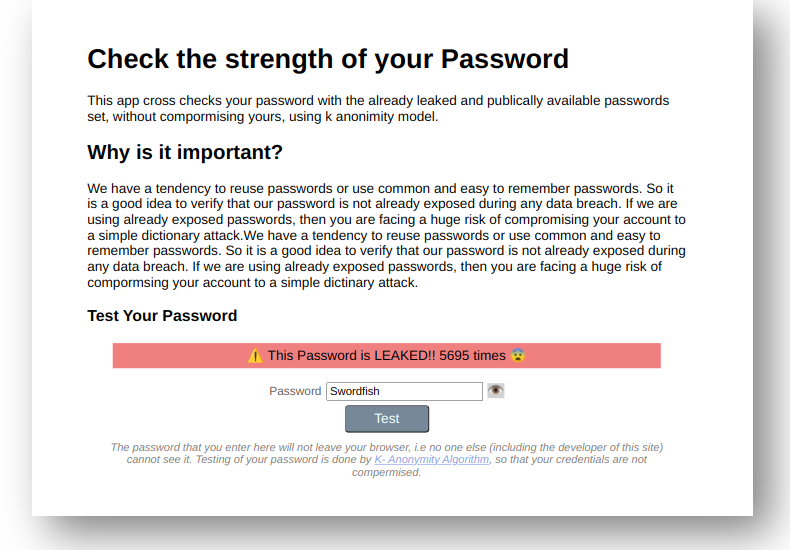

# Introduction

This is an attempt to make an app that uses the k anonimity model API of *haveibeenpwned.com* to verify whether a password in already there in the leaked and publically available list.

## Terminal App

## Web App
checkout the webapp <a href = "https://jishnujp.github.io/securityTools">here<a>

